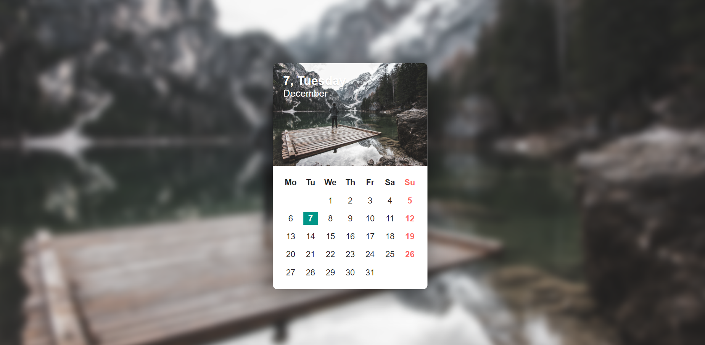

# Dynamic Calendar
A calendar that uses moment.js to capture day, date, month, year.

## Deployed Link

* [Calendar live link](https://github.com/rev1311/calendar_test)

## Built With

* [HTML](https://developer.mozilla.org/en-US/docs/Web/HTML)
* [CSS](https://developer.mozilla.org/en-US/docs/Web/CSS)
* [JavaScript](https://javascript.com)

